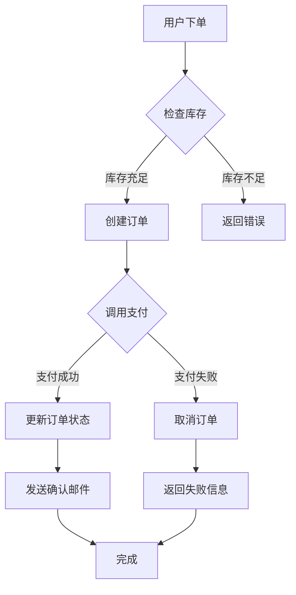
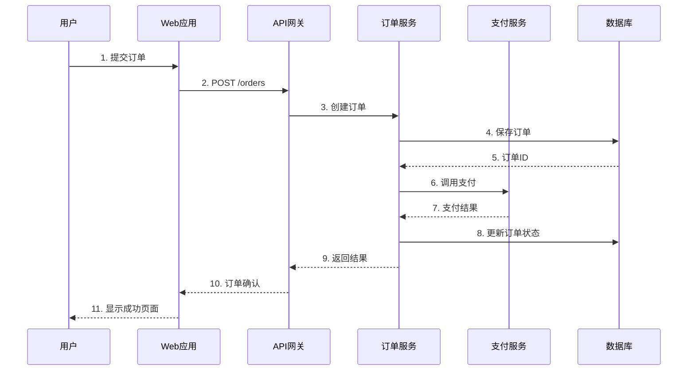
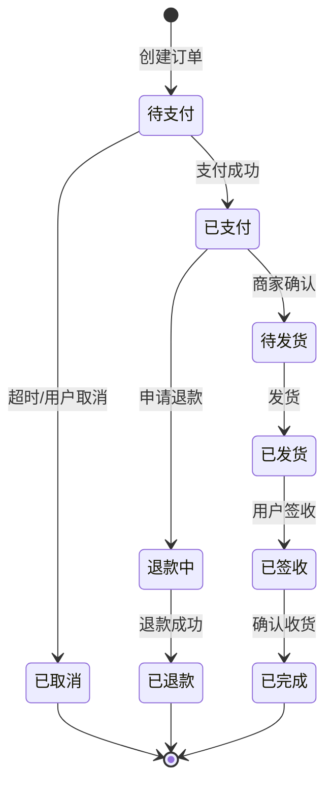
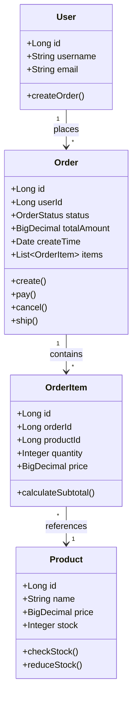
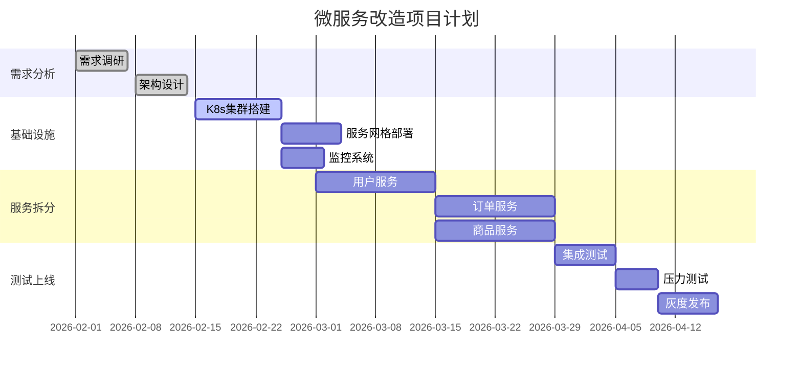

# 架构文档编写指南

## 1. C4 Model完整教程

### 1.1 C4模型四个层次

```
C4 Model层次结构
┌────────────────────────────────────────────────────┐
│ Level 1: Context (系统上下文图)                    │
│ - 目标：展示系统与外部的交互                       │
│ - 受众：所有人（技术、非技术）                     │
│ - 抽象级别：最高                                   │
└────────────────────────────────────────────────────┘
                    ↓ (缩放)
┌────────────────────────────────────────────────────┐
│ Level 2: Container (容器图)                        │
│ - 目标：展示系统内部的应用和数据存储               │
│ - 受众：开发团队、架构师                           │
│ - 抽象级别：高                                     │
└────────────────────────────────────────────────────┘
                    ↓ (缩放)
┌────────────────────────────────────────────────────┐
│ Level 3: Component (组件图)                        │
│ - 目标：展示容器内部的组件                         │
│ - 受众：开发团队                                   │
│ - 抽象级别：中                                     │
└────────────────────────────────────────────────────┘
                    ↓ (缩放)
┌────────────────────────────────────────────────────┐
│ Level 4: Code (代码图)                             │
│ - 目标：展示组件内部的类/接口                      │
│ - 受众：开发者                                     │
│ - 抽象级别：低（UML类图）                          │
└────────────────────────────────────────────────────┘
```

### 1.2 Level 1: 系统上下文图

```
电商系统上下文图
┌──────────────────────────────────────────────────────────┐
│                                                          │
│   ┌────────────┐                    ┌────────────┐     │
│   │   客户     │                    │  管理员    │     │
│   │  (Person)  │                    │  (Person)  │     │
│   └─────┬──────┘                    └──────┬─────┘     │
│         │                                  │            │
│         │ 浏览商品、下单                   │ 管理商品   │
│         │ 查看订单                         │ 查看报表   │
│         ↓                                  ↓            │
│   ┌──────────────────────────────────────────┐          │
│   │                                          │          │
│   │         电商系统                         │          │
│   │      (Software System)                   │          │
│   │                                          │          │
│   │  提供在线购物、订单管理、                │          │
│   │  库存管理等功能                          │          │
│   │                                          │          │
│   └─────┬──────────────────────────┬─────────┘          │
│         │                          │                    │
│         │ 发送邮件                 │ 调用支付API        │
│         ↓                          ↓                    │
│   ┌──────────┐              ┌──────────┐              │
│   │ 邮件服务 │              │ 支付网关 │              │
│   │(External)│              │(External)│              │
│   └──────────┘              └──────────┘              │
│                                                          │
└──────────────────────────────────────────────────────────┘

图例:
- Person (人): 椭圆形
- Software System (系统): 矩形
- External System (外部系统): 矩形（灰色）
- 箭头: 交互关系
```

**PlantUML代码**：

```plantuml
@startuml
!include https://raw.githubusercontent.com/plantuml-stdlib/C4-PlantUML/master/C4_Context.puml

LAYOUT_WITH_LEGEND()

title 电商系统上下文图

Person(customer, "客户", "购买商品的用户")
Person(admin, "管理员", "管理商品和订单")

System(ecommerce, "电商系统", "提供在线购物、订单管理、库存管理等功能")

System_Ext(email, "邮件服务", "发送订单确认和通知邮件")
System_Ext(payment, "支付网关", "处理支付交易")

Rel(customer, ecommerce, "浏览商品、下单、查看订单", "HTTPS")
Rel(admin, ecommerce, "管理商品、查看报表", "HTTPS")
Rel(ecommerce, email, "发送邮件", "SMTP")
Rel(ecommerce, payment, "处理支付", "HTTPS/API")

@enduml
```

### 1.3 Level 2: 容器图

```
电商系统容器图
┌──────────────────────────────────────────────────────────────┐
│                         电商系统                              │
│                                                              │
│  ┌──────────────┐                    ┌──────────────┐      │
│  │  Web应用     │                    │  移动应用    │      │
│  │  (React)     │                    │  (React Native)     │
│  └──────┬───────┘                    └──────┬───────┘      │
│         │                                   │              │
│         │ API调用 (HTTPS/JSON)              │              │
│         └───────────────┬───────────────────┘              │
│                         ↓                                  │
│                  ┌──────────────┐                          │
│                  │  API网关     │                          │
│                  │  (Spring Cloud)                         │
│                  └──────┬───────┘                          │
│                         │                                  │
│         ┌───────────────┼───────────────┐                 │
│         ↓               ↓               ↓                 │
│  ┌────────────┐  ┌────────────┐  ┌────────────┐          │
│  │ 用户服务   │  │ 订单服务   │  │ 商品服务   │          │
│  │(Spring Boot)  │(Spring Boot)  │(Spring Boot)          │
│  └─────┬──────┘  └─────┬──────┘  └─────┬──────┘          │
│        │               │               │                  │
│        ↓               ↓               ↓                  │
│  ┌────────────┐  ┌────────────┐  ┌────────────┐          │
│  │  用户DB    │  │  订单DB    │  │  商品DB    │          │
│  │(PostgreSQL)│  │(PostgreSQL)│  │(PostgreSQL)│          │
│  └────────────┘  └────────────┘  └────────────┘          │
│        │               │               │                  │
│        └───────────────┼───────────────┘                  │
│                        ↓                                  │
│                  ┌────────────┐                           │
│                  │   Redis    │                           │
│                  │   (缓存)    │                           │
│                  └────────────┘                           │
└──────────────────────────────────────────────────────────────┘
```

**PlantUML代码**：

```plantuml
@startuml
!include https://raw.githubusercontent.com/plantuml-stdlib/C4-PlantUML/master/C4_Container.puml

title 电商系统容器图

Person(customer, "客户")

System_Boundary(ecommerce, "电商系统") {
    Container(web, "Web应用", "React", "提供电商功能的Web界面")
    Container(mobile, "移动应用", "React Native", "提供电商功能的移动应用")
    Container(api_gateway, "API网关", "Spring Cloud Gateway", "统一API入口")

    Container(user_service, "用户服务", "Spring Boot", "管理用户信息和认证")
    Container(order_service, "订单服务", "Spring Boot", "处理订单逻辑")
    Container(product_service, "商品服务", "Spring Boot", "管理商品信息")

    ContainerDb(user_db, "用户数据库", "PostgreSQL", "存储用户数据")
    ContainerDb(order_db, "订单数据库", "PostgreSQL", "存储订单数据")
    ContainerDb(product_db, "商品数据库", "PostgreSQL", "存储商品数据")

    ContainerDb(cache, "缓存", "Redis", "缓存热点数据")
}

Rel(customer, web, "使用", "HTTPS")
Rel(customer, mobile, "使用", "HTTPS")
Rel(web, api_gateway, "调用API", "HTTPS/JSON")
Rel(mobile, api_gateway, "调用API", "HTTPS/JSON")

Rel(api_gateway, user_service, "路由请求", "HTTP/gRPC")
Rel(api_gateway, order_service, "路由请求", "HTTP/gRPC")
Rel(api_gateway, product_service, "路由请求", "HTTP/gRPC")

Rel(user_service, user_db, "读写", "SQL/JDBC")
Rel(order_service, order_db, "读写", "SQL/JDBC")
Rel(product_service, product_db, "读写", "SQL/JDBC")

Rel(user_service, cache, "读写", "Redis协议")
Rel(order_service, cache, "读写", "Redis协议")
Rel(product_service, cache, "读写", "Redis协议")

@enduml
```

### 1.4 Level 3: 组件图

```
订单服务组件图
┌──────────────────────────────────────────────────────┐
│              订单服务 (Spring Boot)                   │
│                                                      │
│  ┌────────────────────────────────────────────────┐ │
│  │         REST API层                             │ │
│  │  ┌──────────────┐  ┌──────────────┐           │ │
│  │  │OrderController  │ CartController │          │ │
│  │  └──────┬───────┘  └──────┬────────┘           │ │
│  └─────────┼──────────────────┼────────────────────┘ │
│            │                  │                      │
│  ┌─────────┼──────────────────┼────────────────────┐ │
│  │         ↓                  ↓     业务逻辑层     │ │
│  │  ┌──────────────┐  ┌──────────────┐           │ │
│  │  │OrderService  │  │CartService   │           │ │
│  │  └──────┬───────┘  └──────┬────────┘           │ │
│  └─────────┼──────────────────┼────────────────────┘ │
│            │                  │                      │
│  ┌─────────┼──────────────────┼────────────────────┐ │
│  │         ↓                  ↓     数据访问层     │ │
│  │  ┌──────────────┐  ┌──────────────┐           │ │
│  │  │OrderRepository  │PaymentClient │           │ │
│  │  └──────┬───────┘  └──────┬────────┘           │ │
│  └─────────┼──────────────────┼────────────────────┘ │
│            ↓                  │                      │
│     ┌────────────┐           │                      │
│     │  订单数据库│           │                      │
│     └────────────┘           │                      │
│                              ↓                      │
│                       ┌────────────┐                │
│                       │ 支付服务   │                │
│                       └────────────┘                │
└──────────────────────────────────────────────────────┘
```

**PlantUML代码**：

```plantuml
@startuml
!include https://raw.githubusercontent.com/plantuml-stdlib/C4-PlantUML/master/C4_Component.puml

title 订单服务组件图

Container_Boundary(order_service, "订单服务") {
    Component(order_controller, "OrderController", "Spring MVC", "处理订单相关HTTP请求")
    Component(cart_controller, "CartController", "Spring MVC", "处理购物车HTTP请求")

    Component(order_service_logic, "OrderService", "Spring Bean", "订单业务逻辑")
    Component(cart_service_logic, "CartService", "Spring Bean", "购物车业务逻辑")

    Component(order_repo, "OrderRepository", "Spring Data JPA", "订单数据访问")
    Component(payment_client, "PaymentClient", "Feign Client", "调用支付服务")
}

ContainerDb(order_db, "订单数据库", "PostgreSQL", "存储订单数据")
Container_Ext(payment_service, "支付服务", "Spring Boot", "处理支付")

Rel(order_controller, order_service_logic, "调用")
Rel(cart_controller, cart_service_logic, "调用")

Rel(order_service_logic, order_repo, "使用")
Rel(order_service_logic, payment_client, "调用")

Rel(order_repo, order_db, "读写", "SQL/JDBC")
Rel(payment_client, payment_service, "调用", "HTTP/JSON")

@enduml
```

## 2. Mermaid图表

### 2.1 流程图



### 2.2 时序图



### 2.3 状态图



### 2.4 类图



### 2.5 甘特图



## 3. 架构图绘制最佳实践

### 3.1 图表设计原则

```
五大原则:
┌────────────────────────────────────────────────────┐
│ 1. 简洁性 (Simplicity)                             │
│    - 一张图只表达一个主题                          │
│    - 避免过多细节                                  │
│    - 使用合适的抽象级别                            │
└────────────────────────────────────────────────────┘

┌────────────────────────────────────────────────────┐
│ 2. 一致性 (Consistency)                            │
│    - 统一的图标和符号                              │
│    - 统一的命名规范                                │
│    - 统一的颜色方案                                │
└────────────────────────────────────────────────────┘

┌────────────────────────────────────────────────────┐
│ 3. 层次性 (Hierarchy)                              │
│    - 从高层到底层逐步深入                          │
│    - 使用C4模型的4个层次                           │
│    - 每层有明确的受众                              │
└────────────────────────────────────────────────────┘

┌────────────────────────────────────────────────────┐
│ 4. 可读性 (Readability)                            │
│    - 清晰的标签和说明                              │
│    - 合理的布局（从左到右，从上到下）              │
│    - 避免箭头交叉                                  │
└────────────────────────────────────────────────────┘

┌────────────────────────────────────────────────────┐
│ 5. 实用性 (Practicality)                           │
│    - 图表要能解决实际问题                          │
│    - 包含关键的技术决策                            │
│    - 易于更新和维护                                │
└────────────────────────────────────────────────────┘
```

### 3.2 常见错误与改进

```
❌ 错误示例1：信息过载
┌────────────────────────────────────────────────────┐
│  在一张图中包含：                                  │
│  - 所有微服务（20个）                              │
│  - 所有数据库表（50个）                            │
│  - 所有API接口（100个）                            │
│  - 所有消息队列（10个）                            │
│  结果：图表密密麻麻，无法阅读                      │
└────────────────────────────────────────────────────┘

✅ 改进：分层绘制
  - 上下文图：只显示系统级别
  - 容器图：显示主要应用和数据存储
  - 组件图：针对单个服务详细展示

❌ 错误示例2：缺乏图例
  - 使用自定义符号但不解释
  - 颜色没有含义说明
  - 箭头方向不明确

✅ 改进：添加图例
  - 说明每种符号的含义
  - 解释颜色方案
  - 标注箭头含义（数据流、调用关系等）

❌ 错误示例3：静态文档
  - 画完图后不更新
  - 文档与代码脱节
  - 无法反映真实架构

✅ 改进：文档即代码
  - 使用PlantUML/Mermaid代码生成图表
  - 版本控制（Git）
  - CI/CD自动生成
```

## 4. 架构文档模板

### 4.1 系统架构文档

```markdown
# 电商系统架构文档

## 1. 文档信息
- 文档版本: v2.1
- 创建日期: 2026-02-07
- 作者: 张三（架构师）
- 审核: 李四（CTO）

## 2. 系统概述
### 2.1 业务背景
电商平台，支持在线购物、订单管理、库存管理等功能。

### 2.2 业务目标
- 支持100万DAU
- 订单处理能力：10000笔/分钟
- 系统可用性：99.95%

### 2.3 技术目标
- 微服务架构，支持独立扩展
- 容器化部署，支持快速迭代
- 完善的监控和告警体系

## 3. 架构设计
### 3.1 系统上下文
[插入C4 Level 1图]

### 3.2 容器架构
[插入C4 Level 2图]

核心容器：
1. API网关：统一入口，路由、限流、认证
2. 用户服务：用户管理、认证授权
3. 订单服务：订单处理、状态管理
4. 商品服务：商品管理、库存管理
5. 支付服务：支付集成
6. 通知服务：邮件、短信通知

### 3.3 数据架构
- 每个服务独立数据库（Database per Service）
- 使用事件总线（Kafka）同步数据
- Redis缓存热点数据

### 3.4 部署架构
- Kubernetes集群（3个Master + 10个Worker）
- Istio服务网格
- Prometheus + Grafana监控

## 4. 关键设计决策
### 4.1 为什么选择微服务？
参见：ADR-001

### 4.2 为什么选择Kubernetes？
参见：ADR-002

### 4.3 如何保证分布式事务？
采用Saga模式，参见：ADR-003

## 5. 非功能需求
### 5.1 性能
- API响应时间：P95 < 100ms
- 数据库查询：P95 < 50ms
- 页面加载时间：< 2s

### 5.2 可用性
- 系统可用性：99.95%（年停机时间 < 4.38小时）
- RTO（恢复时间目标）：< 15分钟
- RPO（恢复点目标）：< 5分钟

### 5.3 可扩展性
- 支持水平扩展
- 自动弹性伸缩（HPA）
- 数据库读写分离

### 5.4 安全性
- HTTPS加密传输
- JWT认证
- SQL注入防护
- XSS/CSRF防护

## 6. 技术栈
| 层次 | 技术 | 版本 |
|------|------|------|
| 前端 | React | 18.2 |
| 后端 | Spring Boot | 3.0 |
| API网关 | Spring Cloud Gateway | 4.0 |
| 消息队列 | Kafka | 3.4 |
| 缓存 | Redis | 7.0 |
| 数据库 | PostgreSQL | 15 |
| 容器编排 | Kubernetes | 1.28 |
| 服务网格 | Istio | 1.20 |
| 监控 | Prometheus | 2.45 |
| 日志 | ELK Stack | 8.10 |

## 7. 运维方案
### 7.1 部署流程
[插入部署流程图]

### 7.2 监控告警
- 系统监控：CPU、内存、磁盘
- 应用监控：QPS、错误率、响应时间
- 业务监控：订单量、支付成功率

### 7.3 日志管理
- 日志收集：Filebeat
- 日志处理：Logstash
- 日志存储：Elasticsearch
- 日志查询：Kibana

## 8. 灾难恢复
### 8.1 备份策略
- 数据库：每日全量备份 + 实时增量备份
- 配置：Git版本控制
- 代码：GitHub仓库

### 8.2 故障恢复
1. 单个服务故障：自动重启（K8s）
2. 数据库故障：主从切换
3. 机房故障：跨区域容灾

## 9. 演进计划
### Q1 2026
- 完成微服务拆分
- 部署K8s生产环境

### Q2 2026
- 引入服务网格（Istio）
- 实施分布式追踪

### Q3 2026
- 多活架构
- 异地容灾

## 10. 附录
### 10.1 术语表
- DAU: Daily Active Users（日活跃用户）
- RTO: Recovery Time Objective（恢复时间目标）
- RPO: Recovery Point Objective（恢复点目标）

### 10.2 参考资料
- [微服务架构设计模式]()
- [Kubernetes权威指南]()
- [Martin Fowler博客]()
```

### 4.2 API文档模板

```markdown
# 订单服务API文档

## 1. 基础信息
- 服务名称: Order Service
- Base URL: https://api.example.com/v1/orders
- 认证方式: JWT Bearer Token
- 限流: 1000 req/min

## 2. 通用响应格式
```json
{
  "code": 200,
  "message": "success",
  "data": {},
  "timestamp": "2026-02-07T10:00:00Z"
}
```

## 3. API列表

### 3.1 创建订单
**POST** `/orders`

Request:
```json
{
  "userId": 1001,
  "items": [
    {
      "productId": 5001,
      "quantity": 2,
      "price": 99.99
    }
  ],
  "shippingAddress": {
    "province": "广东省",
    "city": "深圳市",
    "detail": "南山区xxx"
  }
}
```

Response:
```json
{
  "code": 200,
  "message": "success",
  "data": {
    "orderId": 123456,
    "status": "PENDING_PAYMENT",
    "totalAmount": 199.98,
    "createTime": "2026-02-07T10:00:00Z"
  }
}
```

错误码:
- 4001: 商品库存不足
- 4002: 收货地址不完整
- 5001: 订单创建失败

### 3.2 查询订单
**GET** `/orders/{orderId}`

Response:
```json
{
  "code": 200,
  "message": "success",
  "data": {
    "orderId": 123456,
    "userId": 1001,
    "status": "PAID",
    "totalAmount": 199.98,
    "items": [...],
    "createTime": "2026-02-07T10:00:00Z",
    "payTime": "2026-02-07T10:05:00Z"
  }
}
```
```

架构文档完整教程完成！继续创建最后一个文件...
