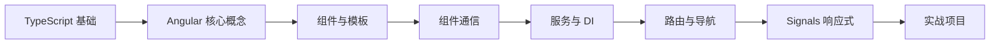

# Angular 学习路径

::: tip 🅰️ 企业级前端框架
Angular 是由 Google 开发维护的企业级前端框架。内置依赖注入、路由、表单处理、HTTP 客户端等，提供完整的开发体验，适合构建大型复杂应用。
:::

## 📚 学习内容

### Angular 基础
- 组件与模板语法
- 数据绑定（插值、属性、事件、双向）
- 指令（内置指令、自定义指令）
- 管道 (Pipe)

### 组件化开发
- @Input / @Output 通信
- 组件生命周期
- 内容投影 (ng-content)
- ViewChild / ContentChild

### 服务与依赖注入
- @Injectable 服务
- 依赖注入层级
- InjectionToken
- inject() 函数

### 路由
- 路由配置与导航
- 路由参数与查询参数
- 路由守卫 (Guard)
- 懒加载

### Signals 响应式
- signal / computed / effect
- Signal Store 模式
- Signal vs RxJS

## 🎯 学习路线

## 📖 推荐资源

- [Angular 官方文档](https://angular.dev/)
- [Angular 中文文档](https://angular.cn/)
- [Angular CLI](https://angular.dev/tools/cli)

## 🔗 相关学习

- 先学习 [JavaScript](/javascript/) 基础
- 掌握 [TypeScript](/javascript/05-typescript/types) 类型系统（Angular 强依赖 TypeScript）
- 学习 [Node.js](/javascript/07-node/http_server) 全栈开发

## 💡 实战建议

1. **TypeScript 优先**：Angular 深度集成 TypeScript，先打好 TS 基础
2. **理解 DI**：依赖注入是 Angular 的核心机制，必须掌握
3. **拥抱 Signal**：Angular 17+ 的 Signal 是未来方向
4. **善用 CLI**：`ng generate` 可以快速生成组件、服务、模块等

---

::: warning 🚧 内容正在完善中
Angular 详细教程和代码示例正在编写中，敬请期待！

如果你有任何建议或想学习的内容，欢迎在 [GitHub Discussions](https://github.com/pengyanhua/full-stack-roadmap/discussions) 中讨论。
:::
