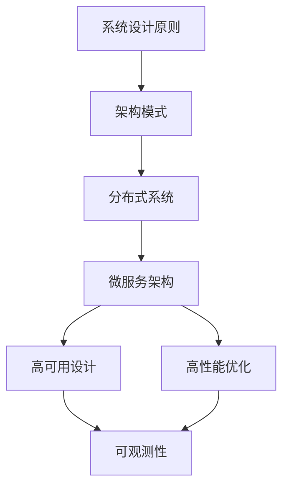

# 系统架构

::: tip 关于系统架构
系统架构是构建高质量软件系统的基础。本模块涵盖系统设计原则、分布式系统、微服务、高可用、高性能等核心主题。
:::

## 🏗️ 架构体系

### 01 - 系统设计

软件设计的核心原则和模式

- **[设计原则](01-system-design/design-principles.md)**：SOLID 原则、DRY、KISS
- **[架构模式](01-system-design/architecture-patterns.md)**：分层、微服务、事件驱动
- **[容量规划](01-system-design/capacity-planning.md)**：性能评估、扩容策略

### 02 - 分布式系统

构建可靠的分布式系统

- **[CAP/BASE 理论](02-distributed/cap-base.md)**：一致性、可用性、分区容错
- **[分布式锁](02-distributed/distributed-lock.md)**：Redis、ZooKeeper 实现
- **[分布式事务](02-distributed/distributed-transaction.md)**：2PC、3PC、Saga

### 03 - 高可用

保障系统的可用性

- **[高可用原则](03-high-availability/ha-principles.md)**：冗余、故障隔离
- **[限流](03-high-availability/rate-limiting.md)**：令牌桶、漏桶算法
- **[故障转移](03-high-availability/failover.md)**：主从切换、自动恢复
- **[容灾](03-high-availability/disaster-recovery.md)**：异地多活、备份恢复

### 04 - 高性能

优化系统性能

- **[性能指标](04-high-performance/performance-metrics.md)**：QPS、延迟、吞吐量
- **[并发优化](04-high-performance/concurrency.md)**：线程池、协程
- **[I/O 优化](04-high-performance/io-optimization.md)**：异步 I/O、零拷贝
- **[池化模式](04-high-performance/pool-pattern.md)**：连接池、对象池

### 05 - 微服务

构建可扩展的微服务架构

- **[服务拆分](05-microservices/service-splitting.md)**：领域驱动设计
- **[API 设计](05-microservices/api-design.md)**：RESTful、GraphQL、gRPC
- **[服务治理](05-microservices/service-governance.md)**：服务发现、负载均衡
- **[Service Mesh](05-microservices/service-mesh.md)**：Istio、Linkerd

### 06 - 数据库架构

数据库设计和优化

- **[MySQL 优化](06-database-architecture/mysql-optimization.md)**：索引、查询优化
- **[分库分表](06-database-architecture/sharding.md)**：水平拆分、垂直拆分
- **[读写分离](06-database-architecture/read-write-splitting.md)**：主从复制

### 07 - 缓存架构

提升系统性能的缓存策略

- **缓存模式**：Cache-Aside、Write-Through、Write-Behind
- **缓存策略**：LRU、LFU、过期策略

### 08 - 消息队列

构建异步和解耦的系统

- **MQ 模式**：点对点、发布订阅
- **可靠性保证**：消息持久化、幂等性

### 09 - 安全

保障系统安全

- **认证与授权**：OAuth、JWT
- **加密**：对称加密、非对称加密
- **安全防护**：SQL 注入、XSS、CSRF

### 10 - 可观测性

监控和诊断系统

- **日志**：日志收集、分析
- **指标**：监控指标、告警
- **链路追踪**：分布式追踪

## 🎯 学习路径



## 💡 核心概念

### 架构设计原则

| 原则 | 说明 | 应用场景 |
|------|------|---------|
| **单一职责** | 一个模块只做一件事 | 服务拆分、类设计 |
| **开闭原则** | 对扩展开放，对修改关闭 | 插件系统、策略模式 |
| **依赖倒置** | 依赖抽象而非实现 | 接口设计、依赖注入 |
| **高内聚低耦合** | 模块内部紧密，模块间松散 | 微服务设计 |

### CAP 理论

::: warning CAP 定理
分布式系统最多只能同时满足以下三项中的两项：
- **C** (Consistency)：一致性
- **A** (Availability)：可用性
- **P** (Partition tolerance)：分区容错性
:::

常见选择：
- **CP**：ZooKeeper、HBase
- **AP**：Cassandra、DynamoDB
- **CA**：传统关系型数据库（单机）

### 微服务模式

```
┌─────────────────────────────────────────────────┐
│                  API Gateway                     │
│         (认证、限流、路由、聚合)                  │
└──────────┬─────────┬─────────┬──────────────────┘
           │         │         │
    ┌──────▼──┐  ┌───▼────┐  ┌▼──────────┐
    │ 用户服务 │  │订单服务│  │ 支付服务   │
    └──────┬──┘  └───┬────┘  └┬──────────┘
           │         │         │
    ┌──────▼─────────▼─────────▼──────────┐
    │         服务注册与发现中心            │
    │         (Consul / Eureka)           │
    └─────────────────────────────────────┘
```

## 🔧 实践建议

### 1. 架构设计

- ✅ 从业务出发，不要过度设计
- ✅ 优先考虑可维护性而非性能
- ✅ 使用成熟的技术栈
- ✅ 保持架构的演进性

### 2. 性能优化

::: tip 优化顺序
1. **数据库优化**：索引、查询优化
2. **缓存**：Redis、CDN
3. **异步化**：消息队列
4. **水平扩展**：分库分表、负载均衡
:::

### 3. 高可用保障

```
可用性级别：
- 99.9%  (3 个 9)  → 年停机时间 8.76 小时
- 99.99% (4 个 9)  → 年停机时间 52.56 分钟
- 99.999% (5 个 9) → 年停机时间 5.26 分钟
```

实现手段：
- 负载均衡
- 主从切换
- 熔断降级
- 限流保护

## 📚 经典案例

### 秒杀系统设计

**挑战**：
- 瞬时高并发
- 库存超卖
- 用户体验

**解决方案**：
```
用户请求
    ↓
【前端】
    - 按钮防重复点击
    - 验证码
    ↓
【接入层】
    - CDN 静态资源
    - Nginx 限流
    ↓
【应用层】
    - Redis 预减库存
    - 消息队列削峰
    ↓
【数据层】
    - MySQL 扣减库存（乐观锁）
    - 订单异步处理
```

### 海量数据处理

**场景**：10 亿条用户数据查询

**方案**：
1. **分库分表**：按用户 ID hash
2. **索引优化**：建立合适的索引
3. **读写分离**：主库写，从库读
4. **缓存**：热点数据放 Redis
5. **ES 搜索**：复杂查询用 Elasticsearch

## 🚀 进阶资源

- 📖 [《凤凰架构》](http://icyfenix.cn/)
- 📖 [《分布式系统原理与范型》](https://book.douban.com/subject/11691266/)
- 🎥 [InfoQ - 架构师成长之路](https://www.infoq.cn/)
- 🎯 [System Design Primer](https://github.com/donnemartin/system-design-primer)

---

开始你的架构师之旅！🏗️
