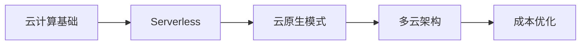

# 云原生架构

::: tip 🚀 现代化应用基础设施
云原生代表了应用开发和部署的现代化方式，充分利用云计算的优势，实现弹性、可扩展和高效的系统架构。
:::

## 📚 学习内容

### 云计算基础
- **云服务模型**
  - IaaS、PaaS、SaaS
  - 公有云、私有云、混合云
  - 云服务商对比

- **核心服务**
  - 计算服务 (EC2, ECS)
  - 存储服务 (S3, EBS)
  - 网络服务 (VPC, CDN)
  - 数据库服务 (RDS, DynamoDB)

### Serverless 架构
- **函数即服务 (FaaS)**
  - AWS Lambda
  - Azure Functions
  - Google Cloud Functions

- **事件驱动架构**
  - 事件源和触发器
  - 函数编排
  - 冷启动优化

- **Serverless 应用模式**
  - API 网关 + Lambda
  - 事件处理
  - 定时任务

### 云原生模式
- **12-Factor App**
  - 代码库、依赖、配置
  - 构建、运行、部署

- **微服务架构**
  - 服务拆分
  - 服务通信
  - 服务发现

- **容器化**
  - Docker 容器
  - Kubernetes 编排
  - Service Mesh

### 多云策略
- **多云架构设计**
  - 供应商锁定规避
  - 灾备策略
  - 负载分配

- **多云管理**
  - 统一监控
  - 统一部署
  - 成本管理

### 成本优化
- **成本分析**
  - 资源使用分析
  - 成本归因
  - 预算预警

- **优化策略**
  - 预留实例
  - Spot 实例
  - 自动扩缩容
  - 存储优化

## 🎯 学习路线

## 📖 推荐资源

- [Cloud Native Computing Foundation](https://www.cncf.io/)
- [AWS Well-Architected Framework](https://aws.amazon.com/architecture/well-architected/)
- [The Twelve-Factor App](https://12factor.net/)
- 《云原生应用架构》

## 🔗 相关学习

- 学习 [容器化](/container/) 技术
- 掌握 [DevOps](/devops/) 实践
- 了解 [微服务](/architecture/05_microservices/01_service_splitting) 架构

## 💡 实战建议

1. **动手实践**：注册云服务免费试用，实际部署应用
2. **成本意识**：从开始就关注成本，养成优化习惯
3. **多云学习**：至少了解两家主流云服务商
4. **自动化优先**：使用 IaC 工具管理云资源

---

::: warning 🚧 持续更新中
云原生技术快速发展，内容持续完善中。欢迎在 [GitHub Discussions](https://github.com/pengyanhua/full-stack-roadmap/discussions) 讨论交流。
:::
