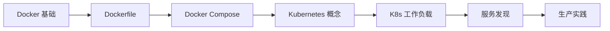

# 容器化学习路径

::: tip 🐳 现代化应用部署
容器技术彻底改变了应用程序的开发、部署和运维方式。Docker 和 Kubernetes 已成为云原生应用的标准。
:::

## 📚 学习内容

### Docker 基础
- **核心概念**
  - 镜像 (Image)
  - 容器 (Container)
  - 仓库 (Registry)

- **基本操作**
  - 镜像管理
  - 容器生命周期
  - 网络配置
  - 数据卷

- **Dockerfile**
  - 指令详解
  - 多阶段构建
  - 最佳实践
  - 镜像优化

- **Docker Compose**
  - 编排多容器应用
  - 服务定义
  - 网络与卷管理

### Kubernetes 基础
- **核心组件**
  - Master 节点
  - Node 节点
  - etcd 存储
  - API Server

- **工作负载**
  - Pod
  - Deployment
  - StatefulSet
  - DaemonSet
  - Job/CronJob

- **服务发现**
  - Service
  - Ingress
  - DNS

- **配置管理**
  - ConfigMap
  - Secret
  - 环境变量

- **存储**
  - Volume
  - PersistentVolume
  - PersistentVolumeClaim
  - StorageClass

### Kubernetes 进阶
- **调度与资源**
  - 资源限制
  - 调度策略
  - 亲和性与反亲和性

- **监控与日志**
  - Prometheus
  - Grafana
  - ELK Stack

- **安全**
  - RBAC
  - Network Policy
  - Pod Security

## 🎯 学习路线



## 📖 Docker vs Kubernetes

| 维度 | Docker | Kubernetes |
|------|--------|-----------|
| 定位 | 容器引擎 | 容器编排平台 |
| 规模 | 单机/小规模 | 大规模集群 |
| 编排 | Docker Compose | 原生支持 |
| 高可用 | 需额外配置 | 内置支持 |
| 学习曲线 | 简单 | 较陡峭 |

## 📚 推荐资源

- [Docker 官方文档](https://docs.docker.com/)
- [Kubernetes 官方文档](https://kubernetes.io/docs/)
- [Kubernetes 中文社区](https://kubernetes.io/zh-cn/)
- 《Kubernetes in Action》

## 🔗 相关学习

- 了解 [Linux](/linux/) 操作系统基础
- 学习 [Go](/go/) 云原生开发
- 掌握 [系统架构](/architecture/) 微服务设计

## 💡 实战建议

1. **从 Docker 开始**：先掌握容器基础
2. **本地实践**：使用 Minikube 或 Kind 学习 K8s
3. **理解原理**：不只是会用，要理解底层
4. **生产经验**：参与实际项目的容器化改造

## 🛠️ 常用命令

### Docker
```bash
# 镜像管理
docker build -t myapp:v1 .
docker pull nginx:latest
docker images

# 容器管理
docker run -d -p 8080:80 nginx
docker ps
docker stop <container_id>
docker logs <container_id>
```

### Kubernetes
```bash
# Pod 管理
kubectl get pods
kubectl describe pod <pod_name>
kubectl logs <pod_name>

# Deployment 管理
kubectl create deployment nginx --image=nginx
kubectl scale deployment nginx --replicas=3
kubectl rollout status deployment/nginx

# Service 管理
kubectl expose deployment nginx --port=80 --type=NodePort
kubectl get svc
```

---

::: warning 🚧 内容正在完善中
容器化详细教程和代码示例正在编写中，敬请期待！

如果你有任何建议或想学习的内容，欢迎在 [GitHub Discussions](https://github.com/pengyanhua/full-stack-roadmap/discussions) 中讨论。
:::
