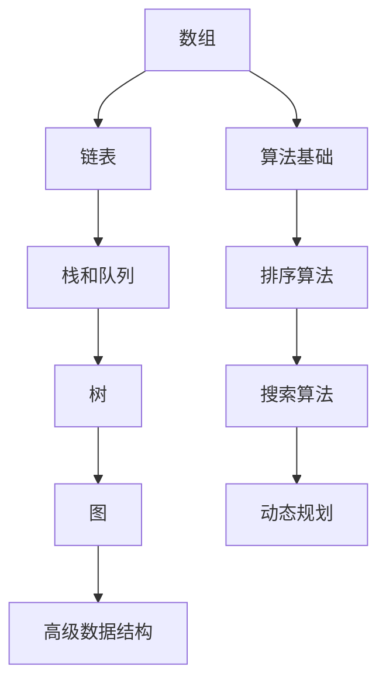

# 数据结构学习路径

::: tip 🔢 算法的基石
数据结构是计算机存储、组织数据的方式，是算法的基础。掌握常用数据结构是每个开发者的必修课。
:::

## 📚 学习内容

### 线性结构
- **数组 (Array)**
  - 静态数组与动态数组
  - 多维数组
  - 数组操作的时间复杂度

- **链表 (Linked List)**
  - 单链表
  - 双向链表
  - 循环链表

- **栈 (Stack)**
  - 后进先出 (LIFO)
  - 应用场景
  - 实现方式

- **队列 (Queue)**
  - 先进先出 (FIFO)
  - 循环队列
  - 优先队列

### 树形结构
- **二叉树**
  - 二叉搜索树 (BST)
  - 平衡二叉树 (AVL)
  - 红黑树

- **堆 (Heap)**
  - 最大堆与最小堆
  - 堆排序
  - 优先队列实现

- **字典树 (Trie)**
  - 前缀树
  - 自动补全
  - 字符串搜索

### 图结构
- **图的表示**
  - 邻接矩阵
  - 邻接表

- **图的遍历**
  - 深度优先搜索 (DFS)
  - 广度优先搜索 (BFS)

- **最短路径**
  - Dijkstra 算法
  - Floyd 算法

### 高级结构
- **哈希表 (Hash Table)**
- **并查集 (Union-Find)**
- **线段树 (Segment Tree)**
- **跳表 (Skip List)**

## 🎯 学习路线

## 📖 时间复杂度对比

| 数据结构 | 查找 | 插入 | 删除 | 空间复杂度 |
|---------|------|------|------|-----------|
| 数组 | O(1) | O(n) | O(n) | O(n) |
| 链表 | O(n) | O(1) | O(1) | O(n) |
| 栈/队列 | O(n) | O(1) | O(1) | O(n) |
| 哈希表 | O(1) | O(1) | O(1) | O(n) |
| 二叉搜索树 | O(log n) | O(log n) | O(log n) | O(n) |

## 📚 推荐资源

- [LeetCode](https://leetcode.cn/) - 在线刷题
- [visualgo](https://visualgo.net/) - 数据结构可视化
- 《算法导论》
- 《数据结构与算法分析》

## 🔗 相关学习

- 使用 [Python](/python/) 实现数据结构
- 了解 [Go](/go/) 标准库的数据结构
- 学习 [Java](/java/) 集合框架

## 💡 实战建议

1. **理解原理**：不要死记硬背，理解为什么
2. **手写实现**：至少用一门语言实现一遍
3. **刷题练习**：LeetCode 至少 100 题
4. **实际应用**：在项目中使用合适的数据结构

---

::: warning 🚧 内容正在完善中
数据结构详细教程和代码示例正在编写中，敬请期待！

如果你有任何建议或想学习的内容，欢迎在 [GitHub Discussions](https://github.com/pengyanhua/full-stack-roadmap/discussions) 中讨论。
:::
