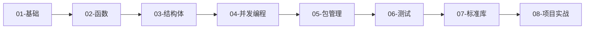

# Go 学习路径

::: tip 关于 Go
Go 是一门简洁、高效、并发友好的编程语言，由 Google 开发，广泛应用于云服务、微服务、DevOps 工具等领域。
:::

## 📚 学习路线

### 01 - 基础

掌握 Go 的基本语法和核心概念

- **变量与类型**：理解 Go 的静态类型系统
- **流程控制**：if/else、for、switch
- **基本数据结构**：数组、切片、映射

### 02 - 函数

深入理解 Go 的函数特性

- **函数基础**：参数、返回值、多返回值
- **函数类型**：函数作为一等公民
- **闭包**：匿名函数和闭包应用

### 03 - 结构体

掌握 Go 的类型系统

- **结构体定义**：类型和方法
- **接口**：隐式接口实现
- **组合**：通过嵌入实现代码复用

### 04 - 并发编程

理解 Go 的并发模型（核心特性）

- **[Goroutines](04-concurrency/goroutines.md)**：轻量级线程
- **[Channels](04-concurrency/channels.md)**：goroutine 间通信
- **[并发模式](04-concurrency/patterns.md)**：常见并发设计模式

### 05 - 包管理

组织和管理代码

- **包导入**：import 机制
- **模块管理**：go.mod、依赖管理
- **标准库**：常用包介绍

### 06 - 测试

编写高质量的测试代码

- **单元测试**：testing 包
- **基准测试**：性能测试
- **示例测试**：可执行文档

### 07 - 标准库

掌握常用标准库

- **I/O 操作**：io、bufio、os
- **网络编程**：net/http、tcp/udp
- **JSON 处理**：encoding/json

### 08 - 项目实战

应用所学知识构建实际项目

- **Web 服务**：HTTP 服务器
- **命令行工具**：CLI 应用
- **微服务**：gRPC 服务

## 🎯 学习建议

1. **循序渐进**：按照编号顺序学习，打好基础
2. **动手实践**：每个示例都要亲自运行和修改
3. **理解并发**：Go 的并发是核心特性，重点学习
4. **查看注释**：代码中的注释包含重要的知识点
5. **完成项目**：理论学习后，一定要动手做项目

## 📖 推荐阅读顺序



## 💡 学习要点

### 核心概念

- ✅ **静态类型**：编译时类型检查
- ✅ **指针**：理解值传递和指针传递
- ✅ **接口**：隐式实现，鸭子类型
- ✅ **goroutine**：轻量级并发
- ✅ **channel**：通信而非共享内存

### 常见陷阱

::: warning 注意
- **切片陷阱**：切片的底层数组可能被共享
- **goroutine 泄漏**：未正确关闭的 goroutine 会造成内存泄漏
- **channel 死锁**：无缓冲 channel 的读写必须配对
- **循环变量**：在 goroutine 中使用循环变量需要特别注意
:::

## 🔧 环境准备

### 安装 Go

```bash
# macOS (使用 Homebrew)
brew install go

# Ubuntu/Debian
sudo snap install go --classic

# Windows
# 从 golang.org 下载安装包
```

### 验证安装

```bash
go version
# 输出：go version go1.21.x ...
```

### 设置工作区

```bash
# 查看 Go 环境变量
go env

# 设置 GOPATH（可选，Go 1.11+ 使用 modules）
export GOPATH=$HOME/go
export PATH=$PATH:$GOPATH/bin
```

## 🚀 快速开始

尝试运行第一个 Go 程序：

```go
// hello.go
package main

import "fmt"

func main() {
    fmt.Println("你好，Go！")
}
```

运行：

```bash
go run hello.go
# 输出：你好，Go！

# 或者编译后运行
go build hello.go
./hello
```

## 🌟 Go 的优势

### 并发支持

Go 的 goroutine 和 channel 让并发编程变得简单：

```go
// 启动 1000 个 goroutine 非常轻松
for i := 0; i < 1000; i++ {
    go func(n int) {
        fmt.Println("Goroutine", n)
    }(i)
}
```

### 编译速度快

```bash
# 编译一个中型项目通常只需几秒
go build
```

### 标准库强大

```go
// 创建一个 HTTP 服务器只需几行代码
http.HandleFunc("/", func(w http.ResponseWriter, r *http.Request) {
    fmt.Fprintf(w, "Hello, World!")
})
http.ListenAndServe(":8080", nil)
```

## 📚 推荐资源

- [Go 官方文档](https://go.dev/doc/)
- [Go by Example](https://gobyexample.com/)
- [Effective Go](https://go.dev/doc/effective_go)
- [Go 语言圣经](https://gopl-zh.github.io/)

## 🎯 学习目标

完成本学习路径后，你将能够：

- ✅ 编写清晰、高效的 Go 代码
- ✅ 使用 goroutine 和 channel 实现并发
- ✅ 设计和实现 RESTful API
- ✅ 编写完善的单元测试
- ✅ 构建生产级的 Go 应用

---

开始你的 Go 学习之旅吧！🚀
