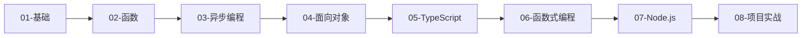

# JavaScript 学习路径

::: tip 关于 JavaScript
JavaScript 是 Web 开发的核心语言，可以运行在浏览器和服务器端（Node.js）。它是唯一能在浏览器中原生运行的编程语言。
:::

## 📚 学习路线

### 01 - 基础

掌握 JavaScript 的基本语法

- **变量与类型**：var、let、const
- **数据类型**：原始类型、引用类型
- **运算符**：算术、比较、逻辑运算
- **流程控制**：if/else、switch、循环

### 02 - 函数

深入理解 JavaScript 的函数

- **函数定义**：函数声明、函数表达式
- **箭头函数**：ES6+ 简洁语法
- **闭包**：作用域链、闭包应用
- **this 关键字**：this 绑定规则
- **高阶函数**：map、filter、reduce

### 03 - 异步编程

掌握 JavaScript 的异步处理

- **回调函数**：Callback
- **Promise**：异步编程解决方案
- **async/await**：同步风格的异步代码
- **事件循环**：Event Loop 机制

### 04 - 面向对象

理解 JavaScript 的 OOP

- **原型链**：prototype、__proto__
- **构造函数**：new 操作符
- **ES6 类**：class 语法糖
- **继承**：原型继承、class 继承

### 05 - TypeScript

学习 JavaScript 的超集

- **类型系统**：静态类型检查
- **接口**：类型约束
- **泛型**：类型参数化
- **装饰器**：元编程

### 06 - 函数式编程

掌握函数式编程范式

- **纯函数**：无副作用
- **不可变性**：Immutable
- **高阶函数**：函数组合
- **柯里化**：Currying

### 07 - Node.js

学习服务器端 JavaScript

- **模块系统**：CommonJS、ES Modules
- **文件操作**：fs 模块
- **HTTP 服务**：http、express
- **异步 I/O**：非阻塞 I/O

### 08 - 项目实战

应用所学知识构建实际项目

- **前端项目**：React/Vue 应用
- **后端 API**：Express/Koa 服务
- **全栈项目**：前后端分离应用

## 🎯 学习建议

1. **先学基础**：扎实掌握语法和核心概念
2. **理解异步**：异步编程是 JavaScript 的核心
3. **多写代码**：在浏览器控制台和 Node.js 中练习
4. **学习 ES6+**：现代 JavaScript 特性
5. **掌握工具**：npm、webpack、babel

## 📖 推荐阅读顺序



## 💡 学习要点

### 核心概念

- ✅ **作用域**：词法作用域、块级作用域
- ✅ **闭包**：理解闭包的原理和应用
- ✅ **this**：this 的绑定规则
- ✅ **原型链**：JavaScript 的继承机制
- ✅ **事件循环**：异步执行机制

### 常见陷阱

::: warning 注意
- **变量提升**：var 会被提升，let/const 有暂时性死区
- **this 绑定**：箭头函数和普通函数的 this 不同
- **闭包内存**：闭包可能导致内存泄漏
- **== vs ===**：建议始终使用 ===
- **异步陷阱**：Promise 链中的错误处理
:::

## 🔧 环境准备

### 浏览器环境

```bash
# 任何现代浏览器都可以运行 JavaScript
# 打开浏览器控制台：
# Chrome/Edge: F12 或 Ctrl+Shift+J
# Firefox: F12 或 Ctrl+Shift+K
```

### Node.js 环境

```bash
# macOS (使用 Homebrew)
brew install node

# Ubuntu/Debian
curl -fsSL https://deb.nodesource.com/setup_18.x | sudo -E bash -
sudo apt install nodejs

# 验证安装
node -v
npm -v
```

## 🚀 快速开始

### 浏览器中运行

```html
<!DOCTYPE html>
<html>
<head>
    <title>JavaScript Demo</title>
</head>
<body>
    <script>
        console.log('你好，JavaScript！');
        alert('欢迎学习 JavaScript');
    </script>
</body>
</html>
```

### Node.js 中运行

```javascript
// hello.js
console.log('你好，JavaScript！');
```

```bash
node hello.js
# 输出：你好，JavaScript！
```

## 🌟 JavaScript 的优势

### 无处不在

```
浏览器 → 前端开发
Node.js → 后端开发
React Native → 移动开发
Electron → 桌面应用
```

### 灵活强大

```javascript
// 函数是一等公民
const add = (a, b) => a + b;

// 对象字面量
const user = { name: 'Alice', age: 25 };

// 数组方法链式调用
[1, 2, 3, 4, 5]
    .filter(x => x % 2 === 0)
    .map(x => x * 2)
    .reduce((a, b) => a + b, 0);
```

### 丰富的生态

- **前端框架**：React、Vue、Angular
- **后端框架**：Express、Koa、NestJS
- **构建工具**：webpack、Vite、Rollup
- **包管理**：npm、yarn、pnpm

## 📚 推荐资源

- [MDN Web 文档](https://developer.mozilla.org/zh-CN/docs/Web/JavaScript)
- [JavaScript.info](https://javascript.info/)
- [TypeScript 官方文档](https://www.typescriptlang.org/)
- [Node.js 官方文档](https://nodejs.org/docs/)

## 🎯 学习目标

完成本学习路径后，你将能够：

- ✅ 熟练使用 JavaScript 编程
- ✅ 理解异步编程和事件循环
- ✅ 掌握 ES6+ 现代特性
- ✅ 使用 TypeScript 编写类型安全的代码
- ✅ 开发前端和后端应用

---

开始你的 JavaScript 学习之旅吧！💛
