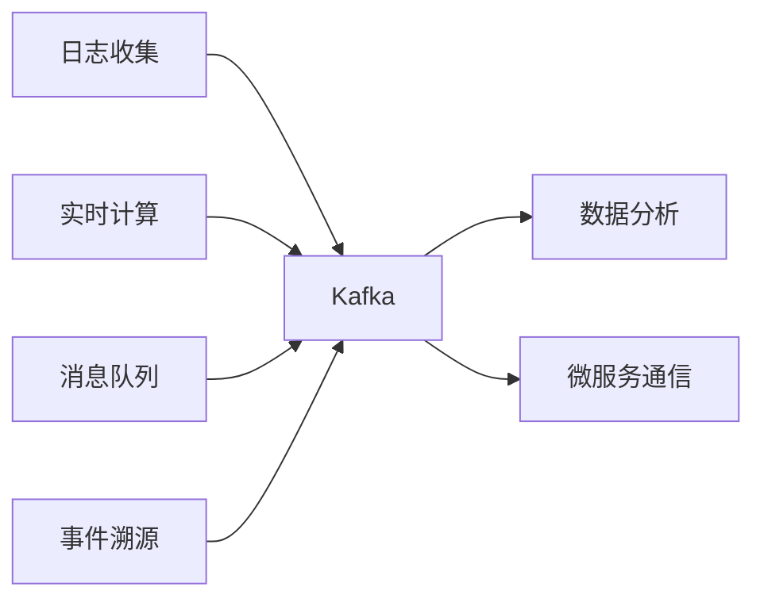

# Kafka 学习路径

::: tip 📨 分布式流处理平台
Apache Kafka 是一个分布式流处理平台，用于构建实时数据管道和流式应用程序。
:::

## 📚 学习内容

### Kafka 基础
- 安装与配置
- 核心概念（Topic、Partition、Consumer Group）
- 生产者与消费者
- ZooKeeper 依赖

### 生产者 (Producer)
- 消息发送
- 分区策略
- 序列化
- 幂等性与事务

### 消费者 (Consumer)
- 消费模式
- 消费者组
- 偏移量管理
- 重平衡机制

### 消息存储
- 日志结构
- 分区副本
- 数据保留策略
- 压缩策略

### 高可用
- 副本机制
- Leader 选举
- ISR 机制
- 故障恢复

### 性能优化
- 批量发送
- 压缩
- 零拷贝
- 分区并行

## 🎯 应用场景

## 📖 推荐资源

- [Kafka 官方文档](https://kafka.apache.org/documentation/)
- [Kafka 中文文档](https://kafka.apachecn.org/)
- 《Kafka 权威指南》

## 🔗 相关学习

- 对比 [Redis](/redis/) 消息队列特性
- 了解 [系统架构](/architecture/) 消息中间件选型
- 学习微服务事件驱动架构

## 💡 实战建议

1. **理解分区**：分区是并行的关键
2. **消费者组**：合理设计消费者组
3. **监控运维**：关注 Lag、吞吐量等指标
4. **数据可靠性**：根据业务选择 ack 级别

---

::: warning 🚧 内容正在完善中
Kafka 详细教程和代码示例正在编写中，敬请期待！

如果你有任何建议或想学习的内容，欢迎在 [GitHub Discussions](https://github.com/pengyanhua/full-stack-roadmap/discussions) 中讨论。
:::
