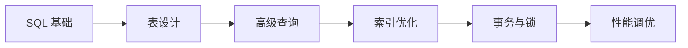

# MySQL 学习路径

::: tip 🗄️ 世界上最流行的开源数据库
MySQL 是最流行的关系型数据库管理系统之一，广泛应用于 Web 应用程序开发。
:::

## 📚 学习内容

### SQL 基础
- DDL（数据定义语言）
- DML（数据操作语言）
- DQL（数据查询语言）
- DCL（数据控制语言）

### 数据类型
- 数值类型
- 字符串类型
- 日期时间类型
- JSON 类型

### 高级查询
- 多表联接 (JOIN)
- 子查询
- 聚合函数
- 窗口函数

### 索引优化
- B+ 树索引
- 唯一索引
- 全文索引
- 索引优化技巧

### 事务与锁
- ACID 特性
- 事务隔离级别
- 锁机制
- MVCC

### 性能优化
- 慢查询分析
- Explain 执行计划
- 查询优化
- 数据库设计规范

## 🎯 学习路线

## 📖 推荐资源

- [MySQL 官方文档](https://dev.mysql.com/doc/)
- [MySQL 中文文档](https://www.mysqlzh.com/)
- 《高性能 MySQL》

## 🔗 相关学习

- 学习 [Redis](/redis/) 缓存数据库
- 了解 [PostgreSQL](/postgresql/) 高级特性
- 掌握 [系统架构](/architecture/) 数据库设计

## 💡 实战建议

1. **理论结合实践**：边学 SQL 边练习
2. **性能意识**：从设计阶段考虑性能
3. **规范开发**：遵循数据库设计范式
4. **问题排查**：学会使用性能分析工具

---

::: warning 🚧 内容正在完善中
MySQL 详细教程和代码示例正在编写中，敬请期待！

如果你有任何建议或想学习的内容，欢迎在 [GitHub Discussions](https://github.com/pengyanhua/full-stack-roadmap/discussions) 中讨论。
:::
