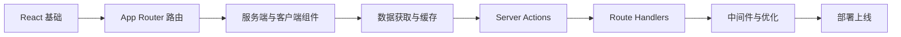

# Next.js 学习路径

::: tip ▲ React 全栈框架
Next.js 是由 Vercel 开发的 React 全栈框架。基于 App Router 架构，内置服务端组件、数据获取、Server Actions、中间件等，提供从开发到部署的完整解决方案。
:::

## 📚 学习内容

### App Router 基础
- 文件系统路由（layouts, pages, loading, error）
- 动态路由与路由分组
- 链接与导航
- 元数据管理

### 服务端与客户端组件
- Server Components（默认）
- Client Components（'use client'）
- 组件组合模式
- 流式渲染与 Suspense

### 数据获取与缓存
- fetch 扩展与缓存策略
- ISR 增量静态再生
- 按需重验证
- 缓存层级

### Server Actions
- 表单处理与数据变更
- useActionState / useFormStatus
- 数据验证与错误处理
- 乐观更新

### Route Handlers
- API 路由端点
- 请求与响应处理
- CORS 与认证

### 中间件
- 请求拦截与路由匹配
- 重定向、重写、认证检查
- 国际化路由

### 性能优化
- Image / Font / Script 组件
- Metadata API
- Core Web Vitals

### 部署
- 构建与静态导出
- Vercel / Docker 部署
- 环境变量管理

## 🎯 学习路线

## 📖 推荐资源

- [Next.js 官方文档](https://nextjs.org/docs)
- [Next.js Learn 教程](https://nextjs.org/learn)
- [Vercel 部署平台](https://vercel.com/)

## 🔗 相关学习

- 先学习 [React](/react/) 基础（Next.js 基于 React）
- 掌握 [TypeScript](/javascript/05-typescript/types) 类型系统
- 了解 [JavaScript](/javascript/) 异步编程

## 💡 实战建议

1. **React 先行**：确保熟悉 React 组件和 Hooks 再学 Next.js
2. **App Router 优先**：直接学习 App Router，不需要先学 Pages Router
3. **理解服务端组件**：这是 Next.js 13+ 最核心的范式转变
4. **动手部署**：用 Vercel 免费部署，体验完整流程

---

::: warning 🚧 内容正在完善中
Next.js 详细教程和代码示例正在编写中，敬请期待！

如果你有任何建议或想学习的内容，欢迎在 [GitHub Discussions](https://github.com/pengyanhua/full-stack-roadmap/discussions) 中讨论。
:::
