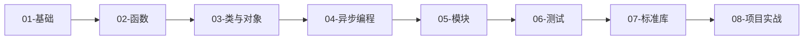

# Python 学习路径

::: tip 关于 Python
Python 是一门简洁、优雅、功能强大的编程语言，广泛应用于 Web 开发、数据科学、人工智能、自动化等领域。
:::

## 📚 学习路线

### 01 - 基础

掌握 Python 的基本语法和核心概念

- **变量与类型**：理解 Python 的动态类型系统
- **运算符**：算术、比较、逻辑、位运算
- **流程控制**：if/else、循环、异常处理

### 02 - 函数

深入理解 Python 的函数式编程特性

- **[函数基础](02-functions/basics.md)**：参数、返回值、文档字符串
- **[闭包与作用域](02-functions/closure.md)**：LEGB 规则、闭包应用
- **[装饰器](02-functions/decorator.md)**：函数装饰器、类装饰器

### 03 - 类与对象

掌握面向对象编程

- **类基础**：定义类、实例化、方法
- **继承**：单继承、多继承、MRO
- **魔术方法**：`__init__`, `__str__`, `__repr__` 等

### 04 - 异步编程

理解 Python 的异步编程模型

- **asyncio 基础**：事件循环、协程
- **async/await**：异步函数、并发执行

### 05 - 模块与包

组织和管理代码

- **模块导入**：import 机制
- **包管理**：pip、虚拟环境
- **标准库**：常用模块介绍

### 06 - 测试

编写高质量的测试代码

- **单元测试**：unittest、pytest
- **测试覆盖率**：coverage
- **Mock 对象**：unittest.mock

### 07 - 标准库

掌握常用标准库

- **文件操作**：pathlib、os
- **数据处理**：json、csv、pickle
- **日期时间**：datetime、time

### 08 - 项目实战

应用所学知识构建实际项目

- **Web 应用**：Flask/Django 项目
- **数据分析**：数据清洗与可视化
- **自动化脚本**：实用工具开发

## 🎯 学习建议

1. **循序渐进**：按照编号顺序学习，不要跳过基础
2. **动手实践**：每个示例都要亲自运行和修改
3. **理解原理**：不仅要知道"怎么做"，还要知道"为什么"
4. **查看注释**：代码中的注释包含重要的知识点和陷阱
5. **完成项目**：理论学习后，一定要动手做项目

## 📖 推荐阅读顺序



## 💡 学习要点

### 核心概念

- ✅ **动态类型**：理解 Python 的类型系统
- ✅ **一切皆对象**：数字、字符串、函数都是对象
- ✅ **鸭子类型**：关注对象的行为而非类型
- ✅ **列表推导**：优雅的数据处理方式
- ✅ **生成器**：高效的迭代器模式

### 常见陷阱

::: warning 注意
- **可变默认参数**：默认参数只在定义时求值一次
- **闭包变量**：循环中创建闭包需要特别注意
- **浅拷贝 vs 深拷贝**：理解对象引用
- **全局变量**：避免过度使用 global
:::

## 🔧 环境准备

### 安装 Python

```bash
# macOS (使用 Homebrew)
brew install python

# Ubuntu/Debian
sudo apt install python3 python3-pip

# Windows
# 从 python.org 下载安装包
```

### 虚拟环境

```bash
# 创建虚拟环境
python -m venv venv

# 激活虚拟环境
# Windows
venv\Scripts\activate
# macOS/Linux
source venv/bin/activate

# 安装依赖
pip install -r requirements.txt
```

## 🚀 快速开始

尝试运行第一个 Python 程序：

```python
# hello.py
def greet(name):
    """向指定的人问好"""
    return f"你好，{name}！"

if __name__ == "__main__":
    message = greet("世界")
    print(message)
```

运行：

```bash
python hello.py
# 输出：你好，世界！
```

## 📚 推荐资源

- [Python 官方文档](https://docs.python.org/zh-cn/3/)
- [Python 风格指南 PEP 8](https://pep8.org/)
- [Real Python](https://realpython.com/)

---

开始你的 Python 学习之旅吧！🐍
