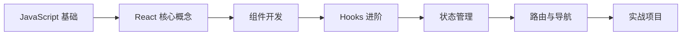

# React 学习路径

::: tip 🚀 现代化前端框架
React 是由 Facebook 开发的用于构建用户界面的 JavaScript 库。以组件化开发为核心，采用声明式编程范式，是目前最流行的前端框架之一。
:::

## 📚 学习内容

### React 基础
- 组件化开发
- JSX 语法
- 虚拟 DOM
- 单向数据流

### Hooks
- useState、useEffect
- useContext、useReducer
- 自定义 Hooks
- Hooks 最佳实践

### 状态管理
- Context API
- Redux / Redux Toolkit
- Zustand
- Recoil

### 路由
- React Router
- 嵌套路由
- 路由守卫
- 代码分割

### 性能优化
- memo、useMemo、useCallback
- 懒加载
- 代码分割
- 性能监控

## 🎯 学习路线

## 📖 推荐资源

- [React 官方文档](https://react.dev/)
- [React 中文文档](https://zh-hans.react.dev/)
- [React 设计模式](https://patterns.dev/)

## 🔗 相关学习

- 先学习 [JavaScript](/javascript/) 基础
- 了解 [TypeScript](/javascript/05-typescript/types) 类型系统
- 学习 [Node.js](/javascript/07-node/http_server) 后端开发

## 💡 实战建议

1. **从简单开始**：先掌握函数组件和基础 Hooks
2. **理解原理**：了解虚拟 DOM 和 Diff 算法
3. **动手实践**：完成至少 3 个完整项目
4. **阅读源码**：学习优秀开源项目的实现

---

::: warning 🚧 内容正在完善中
React 详细教程和代码示例正在编写中，敬请期待！

如果你有任何建议或想学习的内容，欢迎在 [GitHub Discussions](https://github.com/pengyanhua/full-stack-roadmap/discussions) 中讨论。
:::
