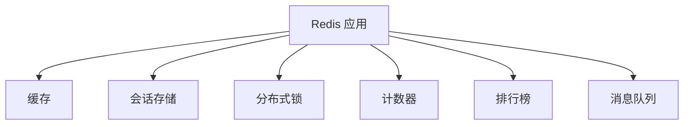

# Redis 学习路径

::: tip ⚡ 高性能内存数据库
Redis 是一个开源的内存数据结构存储系统，可以用作数据库、缓存和消息中间件。
:::

## 📚 学习内容

### Redis 基础
- 安装与配置
- 数据持久化 (RDB/AOF)
- 客户端使用
- 安全配置

### 数据类型
- String (字符串)
- List (列表)
- Set (集合)
- Hash (哈希)
- Sorted Set (有序集合)
- Stream (流)
- Bitmap、HyperLogLog

### 高级特性
- 事务
- 发布订阅
- Lua 脚本
- 过期策略
- 淘汰策略

### 持久化
- RDB 快照
- AOF 日志
- 混合持久化
- 备份恢复

### 高可用
- 主从复制
- Sentinel 哨兵
- Cluster 集群
- 故障转移

### 实战应用
- 缓存设计模式
- 分布式锁
- 限流
- 排行榜
- 消息队列

## 🎯 应用场景

## 📖 推荐资源

- [Redis 官方文档](https://redis.io/docs/)
- [Redis 中文文档](http://www.redis.cn/)
- 《Redis 设计与实现》

## 🔗 相关学习

- 结合 [MySQL](/mysql/) 使用缓存
- 了解 [Kafka](/kafka/) 消息队列差异
- 学习 [系统架构](/architecture/) 缓存设计

## 💡 实战建议

1. **合理使用**：不是所有数据都适合缓存
2. **缓存策略**：理解缓存穿透、击穿、雪崩
3. **性能优化**：使用 pipeline 批量操作
4. **高可用**：生产环境使用集群模式

---

::: warning 🚧 内容正在完善中
Redis 详细教程和代码示例正在编写中，敬请期待！

如果你有任何建议或想学习的内容，欢迎在 [GitHub Discussions](https://github.com/pengyanhua/full-stack-roadmap/discussions) 中讨论。
:::
