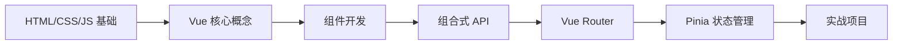

# Vue 学习路径

::: tip 💚 渐进式框架
Vue 是一套用于构建用户界面的渐进式 JavaScript 框架。易学易用，性能出色，适用场景丰富的 Web 前端框架。
:::

## 📚 学习内容

### Vue 基础
- 模板语法
- 响应式数据
- 计算属性
- 侦听器

### 组件化开发
- 组件注册
- Props 传递
- 事件通信
- 插槽 (Slots)

### 组合式 API (Composition API)
- setup 函数
- ref 和 reactive
- computed 和 watch
- 生命周期钩子

### Vue Router
- 路由配置
- 动态路由
- 导航守卫
- 路由懒加载

### 状态管理 (Pinia)
- State
- Getters
- Actions
- 模块化

## 🎯 学习路线

## 📖 推荐资源

- [Vue 3 官方文档](https://vuejs.org/)
- [Vue 3 中文文档](https://cn.vuejs.org/)
- [Vite 构建工具](https://vitejs.dev/)

## 🔗 相关学习

- 先学习 [JavaScript](/javascript/) 基础
- 了解 [TypeScript](/javascript/05-typescript/types) 增强开发体验
- 学习 [Node.js](/javascript/07-node/http_server) 全栈开发

## 💡 实战建议

1. **渐进式学习**：从 Options API 到 Composition API
2. **官方生态**：使用 Vue Router、Pinia、Vite
3. **项目实践**：完成管理后台、博客等项目
4. **性能优化**：了解虚拟 DOM 和优化技巧

---

::: warning 🚧 内容正在完善中
Vue 详细教程和代码示例正在编写中，敬请期待！

如果你有任何建议或想学习的内容，欢迎在 [GitHub Discussions](https://github.com/pengyanhua/full-stack-roadmap/discussions) 中讨论。
:::
